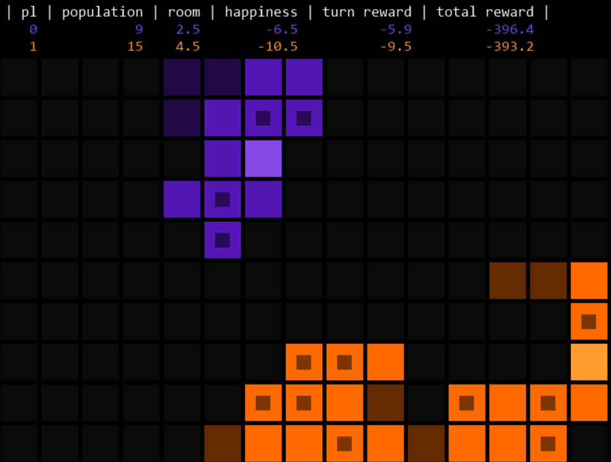
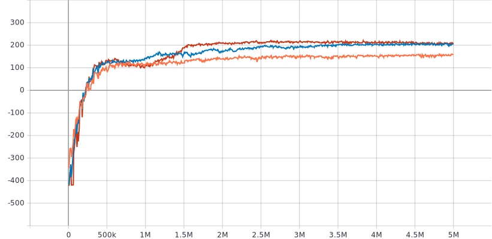
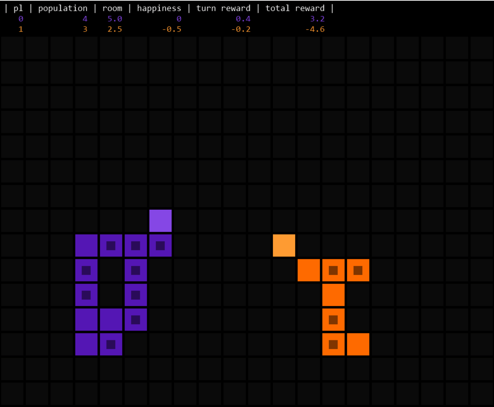

# Expando - a turn-based strategy game rl environment

Expando is a reinforcement learning environment written in python which implements
the [OpenAI Gym](https://github.com/openai/gym) interface. In this environment, agents have to compete in a multiplayer,
turn-based strategy game. The game is played on an `m x n` grid and revolves around strategically placing pieces so that
they generate rewards. The environment is fully configurable and can be random seeded for reproducibility.

## Requirements

The code was tested with python 3.7. It is recommended to install the requirements using a
virtual [anaconda](https://www.anaconda.com/products/individual#Downloads) environment. All dependencies are listed in
`environment.yml`. In order to create an anaconda environment using the yml file, simply run:

```shell
$ conda env create -f environment.yml
```

You can also manually install the dependencies listed using pip3.

## Quickstart

This example demonstrates how to use the environment:

```python
from time import sleep

from gym_env.env import Expando

# initialize the environment
env = Expando(grid_size=(10, 15), n_players=2, max_turns=200, observe_all=True, render=True)
# or load environment using a yaml config file:
# env = Expando.from_config('gym_env/default_config/config.yaml')

# we reset the env and get initial observations for each player since we've set observer_all=True
obs_0, obs_1 = env.reset()
for _ in range(10000):
    # we sample an action from the action space for our agent to take
    action_0 = env.action_space.sample()
    obs_0, reward, done, info = env.step(action_0)

    # since we set observe_all=True, we can get a list of all other observations from the info dict 
    # Here we only get the observation for the 2nd player. 
    obs_1 = info['obs_other'][0]
    reward_1 = info['rewards_other'][0]

    # we can render the environments state if we set render=True and are using a 2D grid.
    env.render()
    sleep(.01)
```


We can now watch two random policies playing expando against each other. The squares with smaller squares inside
represent cities, while the other squares are farms. Greyed out farms do not generate rewards yet.

For more information on the environment arguments, check the docstring in `gym_env/env.py`. It is also possible to load
configurations from yaml files and to extend the environment with custom piece types. See further below for details.

## Game Description

Expando can be played by two or more players. Each player is associated with a cursor that can be moved up, down, left
and right. Each turn, a player can move the cursor by one step or stay at the current position. At the same time the
player can choose to place any type of piece at the new cursor position or to pass. The base game allows placing of 2
types of pieces: `City` and `Farm`.  
There are multiple global measures associated with a player that influence the reward received each step:

* `population`: everytime a Farm is placed the player's population increases
* `room`: everytime the player places a city, additional room is granted.
* `happiness`: happiness is a penalty, computed as max(0, room - population)

The per turn reward is then computed as `turn_reward = sum(building_rewards) + happiness`, where `building_rewards` are
rewards each turn collected from all buildings. In the base game, only farms can generate rewards. A farm generates a
fixed reward each turn, only if it is placed adjacent to a city.

## Configuration and Customization

If not specified by the user, the expando environment uses [hydra](https://github.com/facebookresearch/hydra) for
managing the default configuration, since it allows for composable configuration files. The default configuration files
can be found in `gym_env/default_config`.  
You can change the default configuration and add your own pieces to `piece_types.yaml` with the only requirement being
that they're inheriting from the `Piece` class in `gym_env/game/pieces.py` and that the field `_target_` holds a module
path to the piece's class.

Hydra is especially interesting when trying different configurations for experiments since it can be used to log
hyperparameter settings and swap out different parts of the configuration. An example on how one might want to use hydra
for managing experiment configuration can be found in `experiments/train.py`.

## State + Action Spaces

The Expando environment provides 2 possible representations for both state and action.  
First, the state of the board can be represented as `m x n x (k + s)` dimensional tensor where `m` and `n` are the board
dimensions, `k` is the dimension of a one-hot representation of a field and `s=3` the number of player scores that are
observed, normalized and including a cursor location bit.    
Second, a flat representation which is a single `s + m * n * k` vector with `s=4` since now cursor coordinates are
included as normalized x and y coordinates instead of a cursor bit.

The action space can be set to either discrete or multidiscrete, where each action is encoded as integer or tuple of
integers respectively, with one integer for the direction and one for the typ of piece to place.

For more details see the docstring.

### Experiments

For validating whether the proposed environment is learnable by an agent, we run experiments in which we train a
reinforcement learning agent against a random policy. We find that learning a policy that outperforms a random one is
indeed possible.  
Because of the continuous state space, discrete action space and also for simplicity we chose the DQN algorithm (as
described in [Playing Atari with Deep Reinforcement Learning](https://arxiv.org/pdf/1312.5602.pdf)) for learning the
policy, using an MLP for function approximation. We use
the [stable-baselines3 implementation](https://stable-baselines3.readthedocs.io/en/master/modules/dqn.html) of DQN which
features a replay buffer, a target network and uses gradient clipping.  
For finding a reasonable learning rate and batch size we first ran a small grid search over:

lr: 1e-3, 1e-4, 1e-5  
bs: 64, 128, 512

for 5 million steps each with board size of (12, 16). Then fix learning rate and batch size to 1e-5 and 128 respectively
for the rest of the experiments. All other hyperparameters were left at their default setting which can be found in
`gym_env/default_config` and [here](https://stable-baselines3.readthedocs.io/en/master/modules/dqn.html).  
With these hyperparameter settings, we then train on 3 different sized boards against a random policy. We observe mean
reward per episode, as well as room and population at the end of each episode.  
For each, the mean episode rewards after 5 million steps of training are as follows:

| Grid Size   | Mean Reward     |
| ----------- | :-----------:   |
| 8 x 8       | 157.9           |
| 15 x 20     | 204.3           |
| 20 x 30     | 210.5           |


Mean reward per episode for 8 x 8 (orange), 15 x 20 (blue), 20 x 30 (red)

For reproducing the experiment, simply run:

```shell
$ python -m experiments.train --multirun env.grid_size=[8,8],[15,20],[20,30]
````

The runs took around 2.5h, 3.5h and 5h using a desktop computer with gtx 1070 gpu and a ryzen 3700x processor.  
### DQN (purple), trained against random policy on a 15 x 20 board


